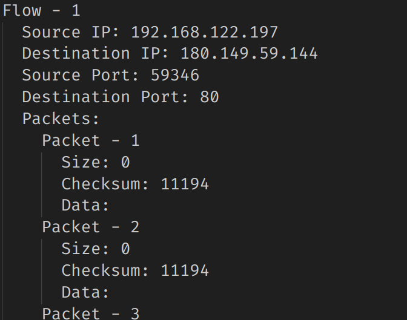
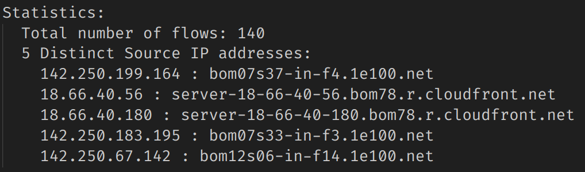
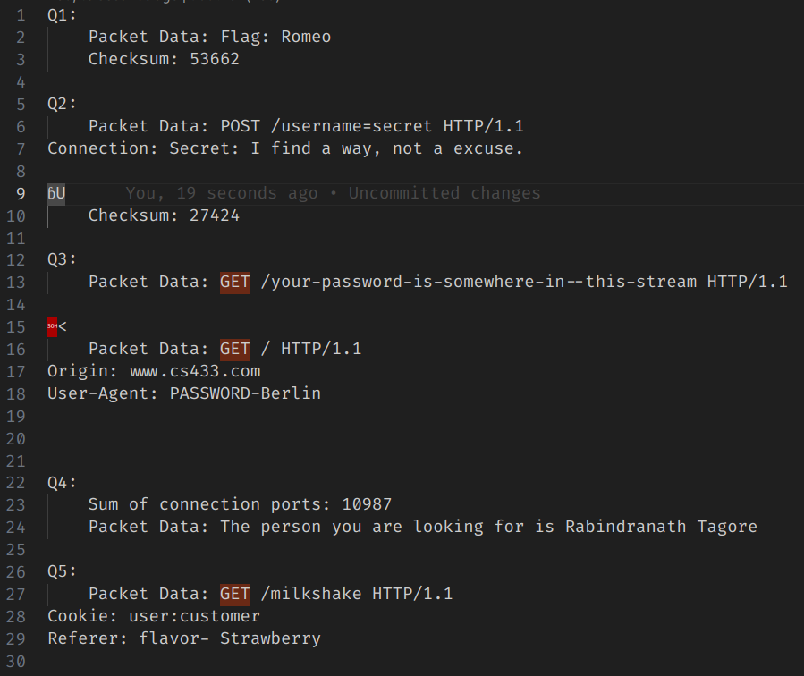
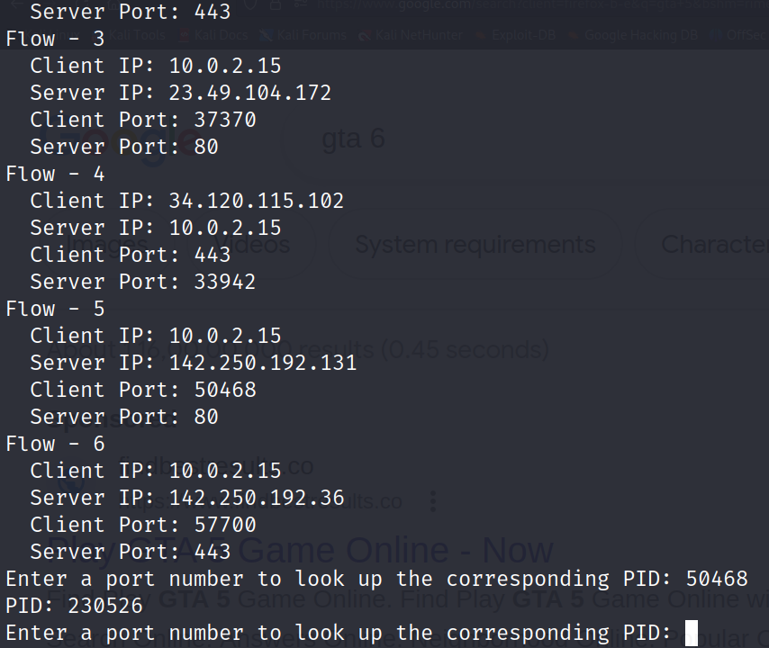
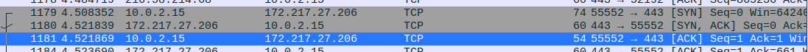
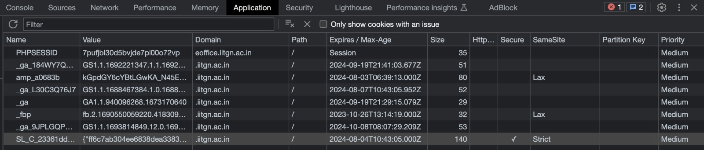

# PART I

### (a)

**Code Explaination:** The code includes three files `flow_table.h`, `flow_table.h`, `flow.h`, `flow.c`, `Q1.c`

**`flow.h`**: Implements the `Packet` structure and the `Flow` structure.

1. The `Packet` structure keeps track of checksum of the packet and the dynamic `unsigned char` array storing the packet data including the application layer headers.
2. `Flow` structure keeps track of 4-tuple of a flow and dynamic array of all the `Packet`'s of the flow.

**`flow.c`**: Implements the `add_packet_data_to_flow` function which adds a `Packet` to a given `Flow`.

**`flow_table.h`**: Implements the `FlowTable` structure which keeps track of a dynamic array of `Flow`'s.

**`flow_table.c`**: Implements functions - `init_flow_table`, `add_flow`, `add_flow_to_table`, `search_flow_in_table`, `print_flow_table`, and `free_flow_table`.

**`Q1.c`**:

1. In the main function we create a `socket` with `AF_PACKET` as the address family, and the `SOCK_RAW` as the socket type, and `ETH_P_ALL` to capture raw packets from the 2nd layer of all protocol types.
2. Of all the packets we capture, we only consider the TCP packets and neglect others, then process the packet(remove headers) and then add the packet to the flow(a new flow is created if it does not exist).
3. When the user exits the program using _ctrl + c_ (using `sighandler` function), we print all the flows and print the statistics of the flows as well. Then we find 5 ip's and the hostnames using the inbuilt function `gethostbyaddr` from the header `netdb.h`.

-   We can compile the binary for Q1 using the command

```console
$ gcc Q1.c flow.c flow_table.c -o Q1
```

-   Run the binary and redirect the output to a file:

```console
$ sudo ./Q1 > Q1.txt
```

-   we can then run the `tcpreplay` command to simulate network traffic:

```console
$ sudo tcpreplay -i eth0 --mbps=1 -v 2.pcap
```

-   Then quit the `Q1` binary using _ctrl + c_.

-   The code displays all the 4 tuple of the flows along with the packet data and their checksums. It also give the statistics which include the flow count and the hostnames of 5 IP's from the traffic.

### (b)

The entire output of the command can be found in the file `Q2.txt`





# PART II

The code includes three files `flow_table.h`, `flow_table.h`, `flow.h`, `flow.c`, `Q2.c`
**`Q2.c`**: Implements the code similar to `Q1.c` but instead of printing flows and the stats, we filtered out the packet data (or) flows, and output the relevant information for each question.

-   Binary for the file can be compiled using:

```console
$ gcc Q2.c flow.c flow_table.c -o Q2
```

-   Run the binary and redirect the output using:

```console
$ sudo ./Q2 > Q2.txt
```

-   Simulate the network traffic using `tcpreplay` command:

```console
$ sudo tcpreplay -i eth0 --mbps=1 -v 1.pcap
```

-   quit the `Q2` binary using `ctrl + c`

The code outputs the packets or flows containing the clues to the questions using handcrafted filters(through observations from all the packets data) in different functions:



Hence,

1. **Flag**: Romeo
2. **Secret**: I find a way, not a excuse.
3. **Password**: Berlin
4. **Person**: Rabindranath Tagore
5. **Flavor**: Strawberry

# PART III

The sourcecode includes `Q3.c`

-   To compile use:

```console
$ gcc Q3.c Q3
```

-   To run the file

```console
$ sudo ./Q3
```



# PART IV

1.

i. Network Protocols
a) SSH Protocol
b) TLSv1.3
c) OCSP
d) RTCP
e) STUN

### SSH (SSH Connection with VM)

    a) 	Operation: Usage/Operation: The Secure Shell (SSH) protocol is a secure way to send commands to a computer over an insecure network. It employs cryptographic techniques to verify identities and encrypt communications between devices. Additionally, SSH supports tunneling, enabling data packets to traverse networks that would typically block them. SSH is commonly employed to remotely manage servers, oversee infrastructure, and transfer files securely.
    b)	RFC: 4254
    c) 	Application Layer

### TLSv1.3 (Most probably while authentication)

    a) 	Operation: TLSv1.3 represents the most recent iteration of the internet's widely adopted security protocol. It serves to encrypt data, establishing a secure communication link between two points. TLSv1.3 achieves this by removing outdated encryption methods, bolstering security compared to previous versions, and striving to encrypt as much of the initial handshake as feasible.
    b)	RFC: 8446
    c) 	Transport Layer

### RTCP (While Running Google Meet)

    a) 	RFC: 3550
    b)	Operation: RTCP, the companion protocol to RTP in VoIP networks, serves the purpose of monitoring streaming media transmission and assessing its quality of service. While not essential for RTP's basic functionality, RTCP plays a crucial role in providing feedback on data distribution quality, supporting RTP's role as a transport protocol. Though RTCP's feedback reports don't pinpoint specific issues, they serve as a valuable tool for problem identification, especially when aggregated from various network media gateways. Network administrators rely on RTCP feedback reports to evaluate and address potential performance degradation within the network.
    c) 	Transport Layer

### STUN (While Running Google Meet)

    a) 	Operation: In a point-to-point (P2P) network, it's essential for both parties to connect directly. Unfortunately, NAT devices can hinder this connection by blocking access. To resolve this issue, STUN technology is often employed for NAT traversal. STUN enables network devices to identify the post-NAT IP addresses and port numbers of the communicating parties, facilitating the establishment of direct P2P data channels that can pass through NAT devices for seamless P2P communication.
    b)	RFC: 5389
    c) 	Layer: Application Layer

### OCSP (Online Certificate Status Protocol)

    a) 	RFC Number: RFC 6960.
    b)	Layer: Application Layer
    c) 	Operation: The Online Certificate Status Protocol (OCSP) offers applications a means to verify the validity of a digital certificate by providing more current revocation status information compared to Certificate Revocation Lists (CRLs).

ii.


In a three way handshake,
The client sends the packets with SYN flag
The server sends the packets with acknowledgement flag
$$ RTT = TimeStamp(SYN/ACK) - TimeStamp(ACK) $$
$$ RTT = 0.013487 \mu s $$

2.  a) github.com
    i. http/2
    b) Netflix.com
    i. http/3, http/2
    ii. In Inspect
    c) Google.com
    i. http/2, http/3
    ii. sometimes http/1.1 (may when opened first time in incognito).

HTTP/1.1, HTTP/2, and HTTP/3 are all protocols used for communication between clients (usually web browsers) and web servers.

-   HTTP Semantics: All three versions are fundamentally based on the same HTTP semantics. They use methods like GET, POST, PUT, DELETE, etc., and they operate on the same HTTP status codes (e.g., 200 OK, 404 Not Found).

-   URI/URL: They all use Uniform Resource Identifiers (URI) or Uniform Resource Locators (URL) to identify and locate resources on the web.

-   Request/Response: They all follow a request-response model where a client sends a request to a server, and the server responds with data, typically in the form of HTML, images, or other types of files.

-   Status Codes: They share common HTTP status codes to indicate the outcome of a request, such as 200 for success, 404 for not found, and 500 for server errors.

-   Headers: All three versions use HTTP headers to convey additional information about the request or response, such as content type, content length, and caching directives.

-   Statelessness: HTTP/1.1, HTTP/2, and HTTP/3 are all stateless protocols, meaning that each request from a client to a server is independent and does not rely on previous requests.

However, despite these similarities, there are significant differences between these protocols:

HTTP/1.1:

-   Uses a single, persistent TCP connection per request/response cycle, which can lead to head-of-line blocking issues.
-   Does not support request and response multiplexing, which means that only one request can be sent or received at a time over a connection.
-   Has no built-in encryption, which makes it susceptible to security vulnerabilities.

HTTP/2:

-   Introduced request and response multiplexing over a single connection, allowing multiple requests and responses to be processed in parallel.
-   Uses binary framing, which makes it more efficient in terms of parsing and transmitting data.
-   Supports header compression, reducing the overhead of sending headers with each request and response.
-   Requires encryption (TLS) by default, enhancing security and privacy.

HTTP/3:

-   Uses the QUIC transport protocol instead of TCP, which provides lower latency and improved congestion control.
-   Further improves request and response multiplexing and reduces head-of-line blocking issues.
-   Continues to use binary framing and header compression for efficiency.
-   Prioritizes security with encryption (TLS) and builds security into the core of the protocol.

HTTP/1.1, HTTP/2, and HTTP/3 share some common elements and HTTP semantics, they differ significantly in terms of performance, efficiency, and security features. HTTP/2 and HTTP/3 were designed to address the limitations of HTTP/1.1.

3.



-   PHPSESSID is a session cookie employed to recognize a user's session on a website.
-   It's frequently utilized in PHP-based web apps to hold a distinct identifier for a user's session on the server.
-   When a user visits such a website, a PHPSESSID cookie is sent to their browser and saved on their device.
-   The server utilizes this cookie to pinpoint the user's session and fetch the relevant session data.
-   Typically, the PHPSESSID cookie's expiration is set to when the user closes their web browser.

**‘\_ga’**
‘\_ga’, the main cookie used by Google Analytics, enables a service to distinguish one visitor from another and lasts for 2 years. Any site that implements Google Analytics, including Google services, uses the ‘\_ga’ cookie. Each ‘\_ga’ cookie is unique to the specific property, so it cannot be used to track a given user or browser across unrelated websites.

**‘\_ga\_\<container-id\>’**
Default expiration state 2 years. Used to persist session state.
Value of above cookies has the timestamp, domain level, random number, version

**\_fbp**
Used by Facebook to deliver a series of advertisement products such as real time bidding from third party advertisers. It expires in 1 day.

References:  
a) https://support.google.com/analytics/answer/11397207?hl=en  
b) https://www.ssh.com/academy/ssh/protocol  
c) https://cookiedatabase.org/cookie/facebook/_fbp/  
d) https://en.wikipedia.org/wiki/Online_Certificate_Status_Protocol  
e) https://en.wikipedia.org/wiki/RTP_Control_Protocol  
f) https://www.ibm.com/docs/en/zos/2.4.0?topic=considerations-tls-v13-protocol-support  
g) https://www.binarytides.com/packet-sniffer-code-in-c-using-linux-sockets-bsd-part-2/  
h) https://www.opensourceforu.com/2015/03/a-guide-to-using-raw-sockets/  
i) https://man7.org/linux/man-pages/man7/packet.7.html  
j) https://man7.org/linux/man-pages/man7/raw.7.html  
g) Slides
