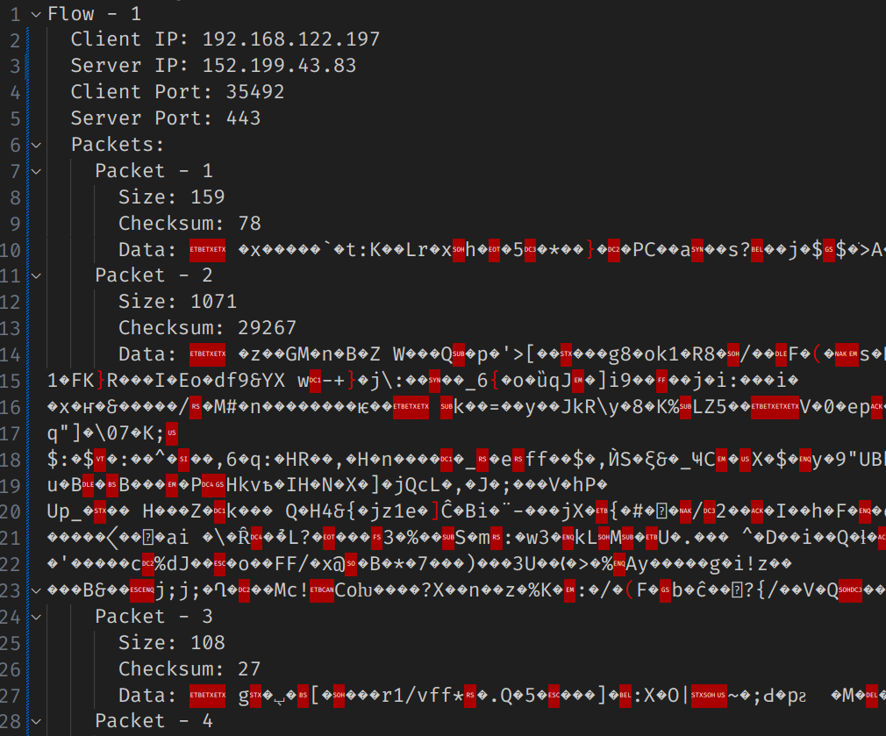
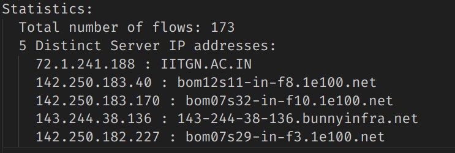

# Q1

### (a)

**Code Explaination:** The code includes three files `flow_table.h`, `flow_table.h`, `flow.h`, `flow.c`, `Q1.c`

**`flow.h`**: Implements the `Packet` structure and the `Flow` structure.

1. The `Packet` structure keeps track of checksum of the packet and the dynamic `unsigned char` array storing the packet data including the application layer headers.
2. `Flow` structure keeps track of 4-tuple of a flow and dynamic array of all the `Packet`'s of the flow.

**`flow.c`**: Implements the `add_packet_data_to_flow` function which adds a `Packet` to a given `Flow`.

**`flow_table.h`**: Implements the `FlowTable` structure which keeps track of a dynamic array of `Flow`'s.

**`flow_table.c`**: Implements functions - `init_flow_table`, `add_flow`, `add_flow_to_table`, `search_flow_in_table`, `print_flow_table`, and `free_flow_table`.

**`Q1.c`**:

1. In the main function we create a `socket` with `AF_PACKET` as the address family, and the `SOCK_RAW` as the socket type, and `ETH_P_ALL` to capture raw packets from the 2nd layer of all protocol types.
2. Of all the packets we capture, we only consider the TCP packets and neglect others, then process the packet(remove headers) and then add the packet to the flow(a new flow is created if it does not exist).
3. When the user exits the program using _ctrl + c_ (using `sighandler` function), we print all the flows and print the statistics of the flows as well. Then we find 5 ip's and the hostnames using the inbuilt function `gethostbyaddr` from the header `netdb.h`.

-   We can compile the binary for Q1 using the command

```console
$ gcc Q1.c flow.c flow_table.c -o Q1
```

-   Run the binary and redirect the output to a file:

```console
$ sudo ./Q1 > Q1.txt
```

-   we can then run the `tcpreplay` command to simulate network traffic:

```console
$ sudo tcpreplay -i eth0 --mbps=1 -v 2.pcap
```

-   Then quit the `Q1` binary using _ctrl + c_.

-   The code displays all the 4 tuple of the flows along with the packet data and their checksums. It also give the statistics which include the flow count and the hostnames of 5 IP's from the traffic.

### (b)

The entire output of the command can be found in the file `Q2.txt`





# Q2

The code includes three files `flow_table.h`, `flow_table.h`, `flow.h`, `flow.c`, `Q2.c`
**`Q2.c`**: Implements the code similar to `Q1.c` but instead of printing flows and the stats, we filtered out the packet data (or) flows, and output the relevant information for each question.

-   Binary for the file can be compiled using:

```console
$ gcc Q2.c flow.c flow_table.c -o Q2
```

-   Run the binary and redirect the output using:

```console
$ sudo ./Q2 > Q2.txt
```

-   Simulate the network traffic using `tcpreplay` command:

```console
$ sudo tcpreplay -i eth0 --mbps=1 -v 1.pcap
```

-   quit the `Q2` binary using `ctrl + c`

The code outputs the packets or flows containing the clues to the questions using handcrafted filters(through observations from all the packets data) in different functions:


Hence,

1. **Flag**: Romeo
2. **Secret**: I find a way, not a excuse.
3. **Password**: Berlin
4. **Person**: Rabindranath Tagore
5. **Flavor**: Strawberry
